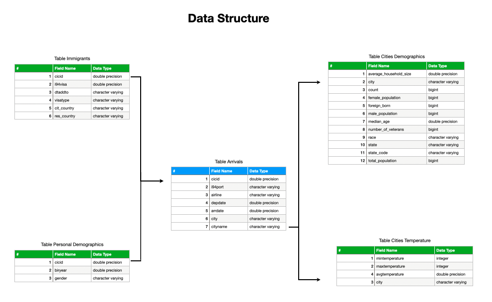

# Data Engineering Capstone Project

## Overview

This is the capstone project for the Udacity's Data Engineering Nanodegree course.

I chose to execute the suggested project by Udacity which is composed of 4 data sources provided in the course's platform:

| Dataset                               | Format                 |  Fields # | Aprox Record Count |
| :---                                  |    :----:              | :----:    |  :----:            |
| I94 Arrivals and Departures in the US | SAS BDAT               | 28        |  40 million        |
| Global Temperatures (Cities)          | CSV                    | 07        |   8 million        |
| Cities Demographics                   | JSON                   | 13        |  3 thousand        |
| Airport Codes                         | CSV                    | 12        |  57 thousand       |

## Project understanding outline

In order to aproximate this capstone project to a real-life project, I developed a hypothetical scenario where I was being provided with the aforementioned datasets and I was tasked to propose an analytical Data Structure (OLAP) to facilitate the analysis of this information by a team of Business Analysts that needed to read this from an AWS RedShift instance. 

### About the datasets

The datasets are comprised of information on immigration process into the United States. The base dataset is the I94 records that are comprised with the information on each passenger that arrived or departed from the United States throughout a year. For that reason I decided to **filter only information related to the United States**.

### Proposed Pipeline

With that purpose in mind I planned the following Data Pipeline:

1) Data Sets in file format are ingested in a S3 bucket
2) Due to the data sizes , a Spark Cluster instance (AWS EMR) imports the data and process the files 
3) The Spark Cluster write the transformed data into tables in the RedShift environment
4) The team can then access the RedShift environment and query the data easily

### Proposed Star Data Schema for the solution

## Steps of the project

### Preparation

*For this project I had an AWS Environment already set with a CLI configured with AWS Secret and Key. As well a user with permissions to manipulate S3, EMR and Redshift.

#### Download datasets

1) Retrieve i94 dataset from Udacity Environment:
    > zip -r data.zip ../../data/18-83510-I94-Data-2016
2) Downloaded I94 Immigration Data (Data.zip)
3) Downloaded [GlobalLandTemperatures](https://www.kaggle.com/berkeleyearth/climate-change-earth-surface-temperature-data)
4) Downloaded [US City Demographic Data](https://public.opendatasoft.com/explore/dataset/us-cities-demographics/export/)
5) Downloaded [Airport Codes](https://datahub.io/core/airport-codes/r/airport-codes.csv)

#### Upload the data to S3

Uploaded all the datasets into a newly created S3 bucket created just for this project.

#### Preparation of the EMR Cluster

Created an EMR cluster with the most up-to-date version, making sure I associate the PEM key to this cluster for management via CLI. Configured Security Groups to accept external connections via SSH in the Inbound Rules.

#### Preparation of the Redshift Cluster

Created an Redshift cluster. Made public access available.

#### Code preparation

I installed a local environment to run Data Quality and prepare the ETL with pure python code. I created two local Jupyter Notebooks:
1) data_quality.ipynb 
2) etl.ipynb

### Execution

#### ETL Execution

To execute the ETL, it is needed to: 

1) In the terminal window, access the EMR Instance
    > aws % ssh -i KEY.pem hadoop@EMRENDPOINTADDRESS
2) Upload etl python file to EMR environment
    > scp etl.py hadoop@EMRENDPOINTADDRESS
3) Run the etl script*
    > /usr/bin/spark-submit --packages saurfang:spark-sas7bdat:3.0.0-s_2.12 --master yarn etl.py

*This commnand ensures we are using the SAS BDAT package to read the SAS files

### Data Analysis

Using any SQL client, the analyst can connect to the Redshift instance and runs some commands, here are some examples

*Count the cities with the higher number of immigration activity*

    SELECT
        cityname,
        COUNT(cicid)
        FROM
        arrivals
    GROUP BY
        cityname
    ORDER BY
        COUNT(cicid) DESC

*Check the airlines used by the visitants from Brazil*

    SELECT DISTINCT
        a.airline,
        i.res_country
    FROM
        arrivals a
        JOIN immigrants i ON a.cicid = i.cicid
    WHERE
        i.res_country = 'Brazil';

### Scalability

The usage of a Big Data Spark environment was made to address the issue of scaliability. If the data is increased by 100 times, we could configure the EMR environment to use more clusters and or more powerful machines.

In order to schedule regular runnings of the pipeline, we could develop an Apache Airflow to schedule the running of this service.

The usage of Redshift was made to accomodate scalable access by the users as well.

## Data Dictionary

*Table Arrivals:*

| Field| Description|
| :--- |    :----:  |
| cicid| Passenger Identifier|
| airline| Airline used by the passenger|
| i94port  | Port of entry in the US|
| depdate  | Departure Date|
| arrdate  | Arrival Date|
| city  | City of port of entry|
| cityname  | Normalized City name|

*Table Immigrations:*

| Field| Description|
| :--- |    :----:  |
| cicid| Passenger Identifier|
| i94visa| Visa code |
| visatype  | Type of visa used for entry/departure|
| cit_country  | Country of citizenship of the traveler |
| res_country  | Country of residency of the traveler |

*Table Personal Demographics:*

| Field| Description|
| :--- |    :----:  |
| cicid| Passenger Identifier|
| biryear| Birthday year of the traveler |
| gender | Gender of the traveler|

*Table Cities Demographics:*

| Field| Description|
| :--- |    :----:  |
| average_household_size| Average household size | 
| city| City Name | 
| count| Count of the  race in the city | 
| female_population| Count of females in the city | 
| foreign_born| Count of foreign_born in the city | 
| male_population| Count of males in the city | 
| median_age| Median age in the city | 
| number_of_veterans| Count of veterans in the city | 
| race| Count of females in the city | 
| state| State of the city | 
| total_population| City's total population | 

*Table Cities Temperatures:*

| Field| Description|
| :--- |    :----:  |
| mintemperature | Minimun average temperature |
| maxtemperature | Maximum average temperature |
| avgtemperature | Mean average temperature |
| city | City name |
